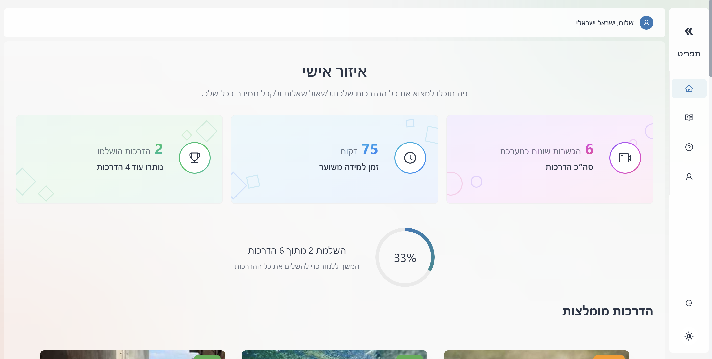
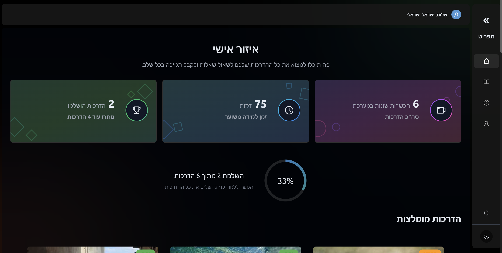
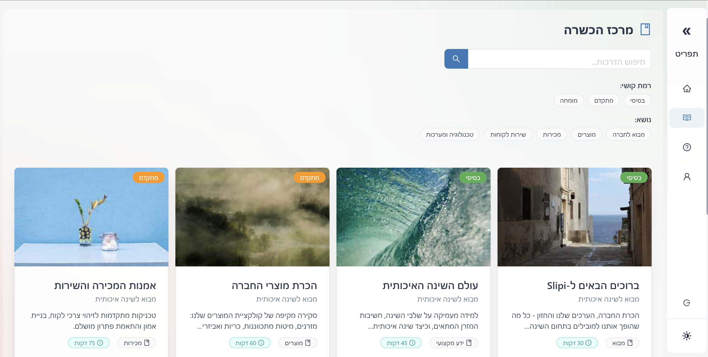
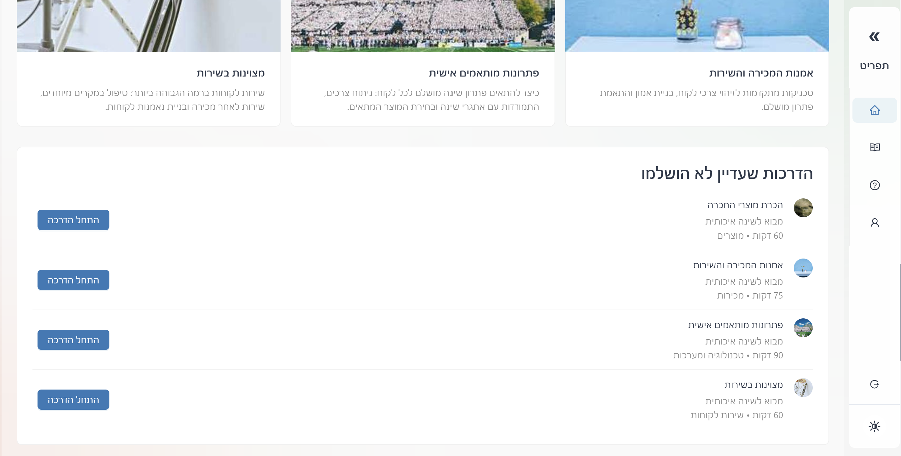

# Slipi - מערכת הכשרה למפיצים 🚀

<p align="center">
  
</p>

<p align="center">
  
  
  
  
  
  
</p>

> **הערה:** זהו דגם ראשוני למערכת הכשרה עבור עסק ישראלי, מרכז הדרכות מכירה ואינפורמציה. האתר המלא אינו זמין ב-GitHub.

מערכת הכשרה למפיצי חברת Slipi, המאפשרת גישה לתכני הכשרה, שאלות ותשובות, ומעקב אחר התקדמות.

## 📸 תצלומי מסך

<div align="center">
  
  
</div>

<div align="center">
  
  
</div>

## ✨ תכונות עיקריות

- 🔐 מערכת התחברות והרשמה מאובטחת עם תמיכה ב-Google Authentication
- 📚 תכני הכשרה מאורגנים בפרקים
- 🎥 תמיכה בסרטוני וידאו ותוכן טקסטואלי
- 💬 מערכת צ'אט לשאלות ותשובות
- 📱 ממשק משתמש מותאם למובייל
- 🌓 תמיכה במצב כהה ובהיר
- 📊 מעקב אחר התקדמות בהכשרה
- 💾 אחסון נתונים ב-PostgreSQL ו-Firebase Storage

## 🛠️ טכנולוגיות

- **Frontend**: React.js, TypeScript, Tailwind CSS, Ant Design
- **Backend**: Firebase Functions
- **Database**: PostgreSQL
- **Authentication**: Firebase Authentication (Google Sign-in)
- **Storage**: Firebase Storage
- **Deployment**: Vercel / Firebase Hosting

## 🔧 דרישות מערכת

- Node.js (גרסה 18 ומעלה)
- npm או yarn
- חשבון Firebase (עבור אימות ואחסון)
- מסד נתונים PostgreSQL

## ⚙️ התקנה

1. שכפל את המאגר:
```bash
git clone https://github.com/AdiYd/Slipi.git
cd Slipi
```

2. התקן את התלויות:
```bash
npm install
```

3. צור קובץ `.env` בתיקיית הפרויקט:
```env
VITE_API_URL=http://your-api-url
VITE_FIREBASE_API_KEY=your-firebase-api-key
VITE_FIREBASE_AUTH_DOMAIN=your-firebase-auth-domain
VITE_FIREBASE_PROJECT_ID=your-firebase-project-id
VITE_FIREBASE_STORAGE_BUCKET=your-firebase-storage-bucket
VITE_FIREBASE_MESSAGING_SENDER_ID=your-firebase-messaging-sender-id
VITE_FIREBASE_APP_ID=your-firebase-app-id
VITE_POSTGRES_CONNECTION_STRING=your-postgres-connection-string
```

4. הפעל את השרת המקומי:
```bash
npm run dev
```

האפליקציה תהיה זמינה בכתובת `http://localhost:5173`

## 💻 פיתוח

- `npm run dev` - הפעל שרת פיתוח
- `npm run build` - בנה את האפליקציה
- `npm run preview` - תצוגה מקדימה של הגרסה הבנויה
- `npm run lint` - בדיקת קוד

## 📁 מבנה הפרויקט

```
src/
├── assets/        # תמונות וקבצי מדיה
├── components/    # רכיבים משותפים
│   ├── common/    # רכיבי UI בסיסיים
│   ├── dashboard/ # רכיבי לוח המחוונים
│   └── layout/    # רכיבי תבנית
├── config/        # הגדרות תצורה
├── contexts/      # React Contexts
├── hooks/         # Custom React Hooks
├── mocks/         # נתונים לדוגמה ותצלומי מסך
├── pages/         # דפי האפליקציה
├── services/      # שירותי API ואינטגרציה
├── styles/        # קבצי סגנון
├── types/         # הגדרות TypeScript
└── utils/         # פונקציות עזר
```

## 🤝 תרומה לפרויקט

1. צור fork של המאגר
2. צור branch חדש (`git checkout -b feature/amazing-feature`)
3. בצע commit לשינויים (`git commit -m 'Add some amazing feature'`)
4. דחוף ל-branch (`git push origin feature/amazing-feature`)
5. פתח Pull Request

## 📝 רישיון

פרויקט זה מופץ תחת רישיון MIT. ראה את קובץ `LICENSE` לפרטים נוספים.

---

<p align="center">
  <sub>נבנה בגאווה בישראל 🇮🇱</sub>
</p>